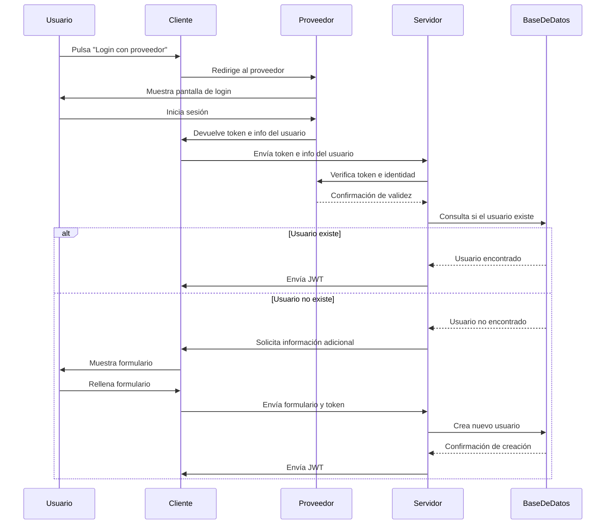

  

<h1 align="center">AgroNET</h1>

# AgroNET

AgroNET es una plataforma web colaborativa diseñada para agricultores, donde podrás **compartir información** sobre tus cosechas con la comunidad, acceder a **precios de mercado en tiempo real** y recibir **alertas climáticas personalizadas**.  
Además, integra **mapas interactivos** para visualizar los datos de las parcelas de España junto con la información meteorológica de la zona.

### Tecnologías y modelos utilizados

AgroNET ha sido desarrollado utilizando una combinación de tecnologías modernas para garantizar una experiencia rápida, intuitiva y adaptable. A continuación se detallan las principales herramientas y librerías empleadas:

#### Tecnologías principales

* **[Astro](https://astro.build)**: Framework moderno para construir sitios web rápidos y optimizados, que permite integrar múltiples frameworks como React, Vue o Svelte. Astro se utiliza como base del proyecto.
* **[React](https://react.dev)**: Biblioteca de JavaScript enfocada en la creación de interfaces de usuario reactivas, utilizada para los componentes interactivos.
* **[Tailwind CSS](https://tailwindcss.com)**: Framework de utilidades CSS para diseñar interfaces personalizables con rapidez y consistencia.
* **[Leaflet](https://leafletjs.com)**: Librería JavaScript de código abierto para mapas interactivos, utilizada para mostrar información geoespacial sobre parcelas agrícolas.
* **[Axios](https://github.com/axios/axios)**: Cliente HTTP basado en promesas para realizar llamadas a APIs externas (por ejemplo, para precios de mercado o datos meteorológicos).
* **[Socket.IO Client](https://github.com/socketio/socket.io)**: Cliente WebSocket utilizado para implementar comunicación en tiempo real (por ejemplo, notificaciones o actualizaciones climáticas en vivo).

####  Autenticación y seguridad

* **[Auth-Astro](https://github.com/nowaythatworked/auth-astro?tab=readme-ov-file#auth-astro)**: En nuestro proyecto Astro, implementamos la autenticación utilizando el paquete auth-astro, una integración comunitaria que facilita la incorporación de **[Auth.js](https://authjs.dev)** en aplicaciones Astro. Este paquete actúa como un adaptador que envuelve el núcleo de Auth.js, permitiendo una configuración sencilla y la gestión de proveedores de autenticación como Google y GitHub.
* **[Dotenv](https://github.com/motdotla/dotenv)**: Herramienta para gestionar variables de entorno de forma segura.

####  Datos y geolocalización

* **[GeoJSON](https://www.npmjs.com/package/geojson)** y **@types/geojson**: Formato estándar para codificar estructuras geográficas que permite manipular y visualizar datos de parcelas.
* **@types/leaflet**: Tipado para Leaflet en TypeScript, que mejora el desarrollo con autocompletado y validaciones.

####  Interfaz y experiencia de usuario

* **[Heroicons](https://heroicons.com)**: Colección de iconos SVG personalizables usados en la interfaz.
* **@headlessui/react**: Componentes accesibles y sin estilos predefinidos que ayudan a construir menús, modales y otros elementos interactivos.
* **@tailwindcss/typography**: Plugin para mejorar la presentación de textos y contenido enriquecido.
* **[ApexChart](https://apexcharts.com)**: Para la visualización de estadísticas en nuestra aplicación, hemos utilizado **[ApexCharts](https://apexcharts.com)**, una biblioteca moderna y de código abierto que permite crear gráficos interactivos y atractivos para aplicaciones web. Específicamente, implementamos la integración con React mediante el paquete **[react-apexcharts](https://www.npmjs.com/package/react-apexcharts)**, que actúa como un contenedor para ApexCharts.js, facilitando su uso en componentes de React.Esta combinación nos permite incorporar diversos tipos de gráficos, como líneas, áreas, barras, y más, de manera sencilla y eficiente en nuestra interfaz de usuario.

####  Pruebas y desarrollo

* **[Cypress](https://www.cypress.io)**: Framework de testing end-to-end usado para probar la aplicación en tiempo real y asegurar su correcto funcionamiento.
* **@types/react**, **@types/react-dom**, **@types/node**: Tipados para el uso correcto de React y Node.js con TypeScript.

#### Diagrama de secuencia de autenticación con proveedores externos

